<div align="center">


<br /><br />

```
 █████╗  ██████╗ ███████╗███╗   ██╗████████╗██╗ ██████╗    ███████╗██╗      ██████╗ ██╗    ██╗
██╔══██╗██╔════╝ ██╔════╝████╗  ██║╚══██╔══╝██║██╔════╝    ██╔════╝██║     ██╔═══██╗██║    ██║
███████║██║  ███╗█████╗  ██╔██╗ ██║   ██║   ██║██║         █████╗  ██║     ██║   ██║██║ █╗ ██║
██╔══██║██║   ██║██╔══╝  ██║╚██╗██║   ██║   ██║██║         ██╔══╝  ██║     ██║   ██║██║███╗██║
██║  ██║╚██████╔╝███████╗██║ ╚████║   ██║   ██║╚██████╗    ██║     ███████╗╚██████╔╝╚███╔███╔╝
╚═╝  ╚═╝ ╚═════╝ ╚══════╝╚═╝  ╚═══╝   ╚═╝   ╚═╝ ╚═════╝   ╚═╝     ╚══════╝ ╚═════╝  ╚══╝╚══╝
```

### **Autonomous Enterprise Workflow OS — Powered by a 7-Agent Neural Squadron**

*Ingest. Plan. Execute. Self-Correct. Report. No humans required.*

</div>

---

## 🚀 What Is AgenticFlow?

**AgenticFlow** is an enterprise-grade, Multi-Agent AI operating system that takes **absolute ownership** of complex, multi-step business processes. Rather than wrapping a simple API or acting as a chatbot, AgenticFlow uses an intelligent **LangGraph orchestration engine** to:

- 📥 Automatically ingest organizational data (live transcripts, compliance triggers)
- 🧠 Dynamically plan and distribute workloads across specialized agents
- 🔁 Catch and **self-correct** exceptions autonomously via retry loops
- ✅ Execute end-to-end without human intervention
- 📋 Maintain an **immutable audit trail** of every autonomous decision in **MongoDB Atlas**

---

## 🎬 Complete User Journey

> The full flow — from role selection to compliance reports — exactly as it runs in production.

```
Role Selected → New Joinee Onboards → Fill Details → Trigger Pipeline → Email via Resend
      → Store in MongoDB → Welcome Portal → Telegram Buddy → Admin Dashboard
      → Agents View → Meeting Room → WebSocket Multi-User → Live Transcription
      → Tasks Extracted → Progress Tracked → Reports Generated → MongoDB Audit Trail
```

---

### Step 1 — Role Selection
> *Secured by Neural Guard & Multisig Verification*

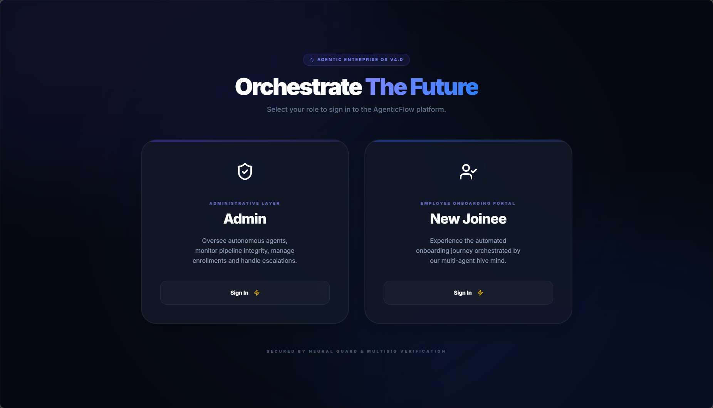

The platform starts with a dual-role gateway. **Admin** (Fleet Commander) oversees autonomous agents, monitors pipelines, and handles escalations. **New Joinee** enters the automated onboarding journey orchestrated by the multi-agent hive mind.

---


### Step 2 — New Joinee Fills Details & Triggers Pipeline


The new associate fills in their name, job role, and department on the **Predictive Observatory** dashboard. Clicking **Trigger Synthesis** fires the full `OnboardingPlanner` pipeline instantly — no manual HR steps required.

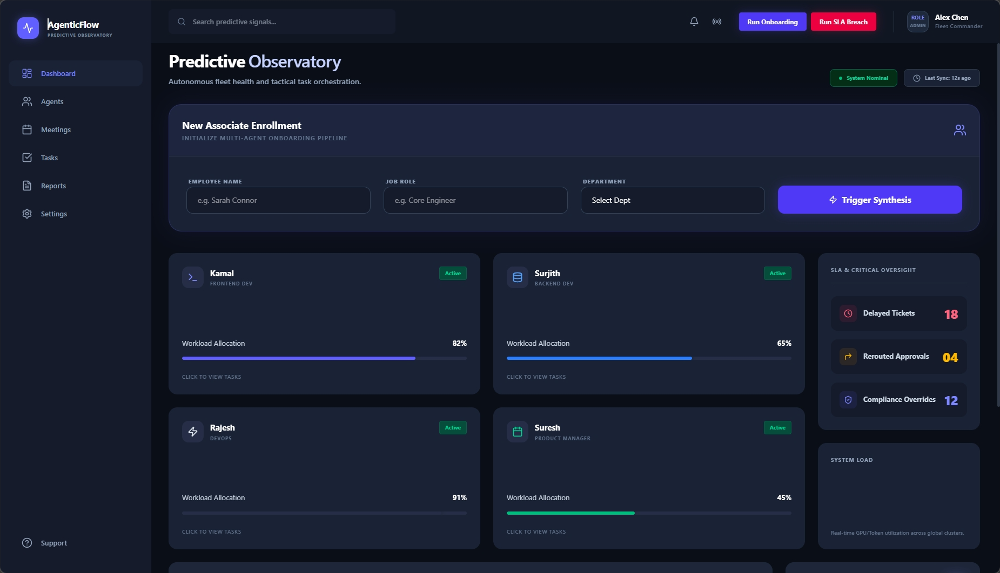

*The dashboard simultaneously shows real-time workload allocation for existing engineers (Kamal 82%, Surjith 65%, Rajesh 91%, Suresh 45%) and live SLA Critical Oversight metrics — all sourced from MongoDB.*

---

### Step 3 — Welcome Email Sent via Resend API

The moment provisioning completes, the **ReportAgent** dispatches a personalized welcome email via the **Resend API** — with the full employee profile, role, department, and confirmation that all tools are live.

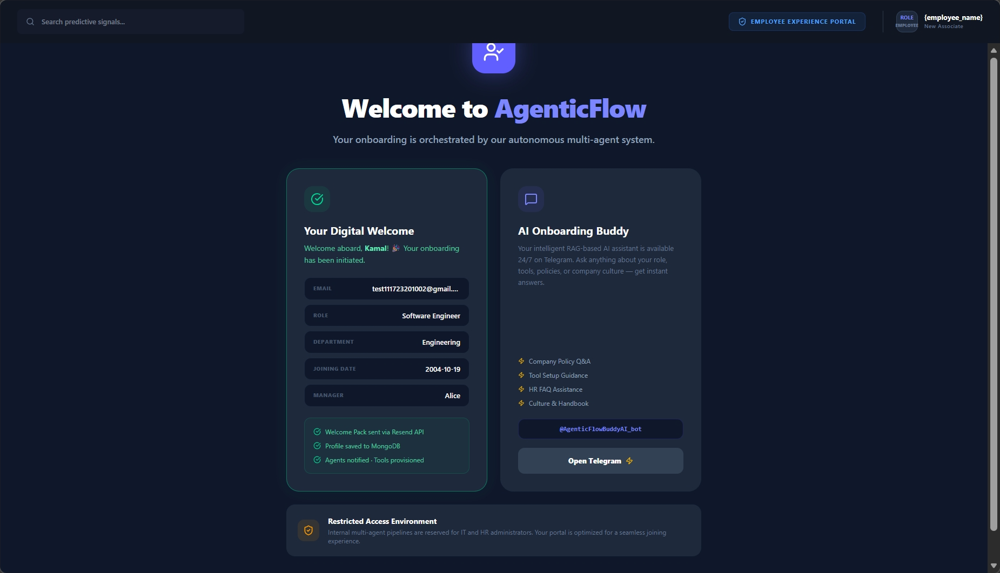

---

### Step 4 — New Joinee Record Stored in MongoDB

Every hire record — `status`, `welcome_email_sent`, `telegram_buddy`, `reporting_manager`, `portal_source` — is persisted to the `new_joinees` collection the instant the pipeline completes.

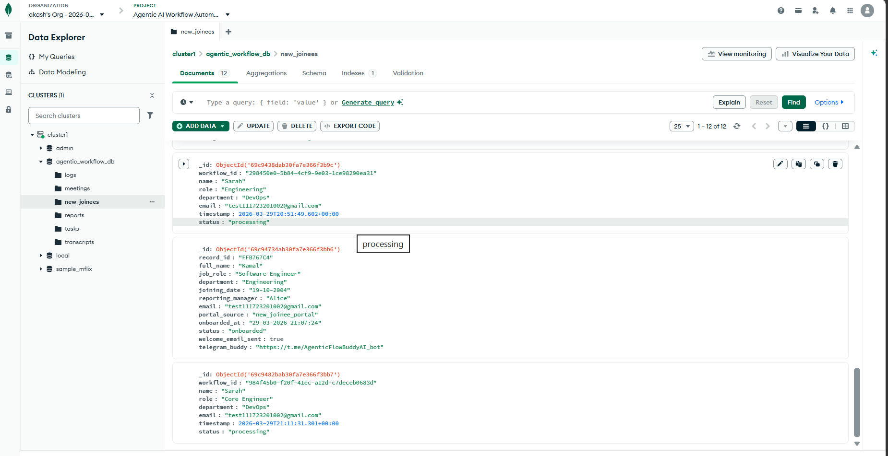

*Records transition `"processing"` → `"onboarded"` as provisioning resolves. The `telegram_buddy` field is auto-set to the RAG bot link on completion.*

---

### Step 5 — New Joinee Welcome Pack Portal

After onboarding, the associate lands on their personal welcome portal: profile confirmed, tools provisioned, and the **AI Onboarding Buddy** ready on Telegram.

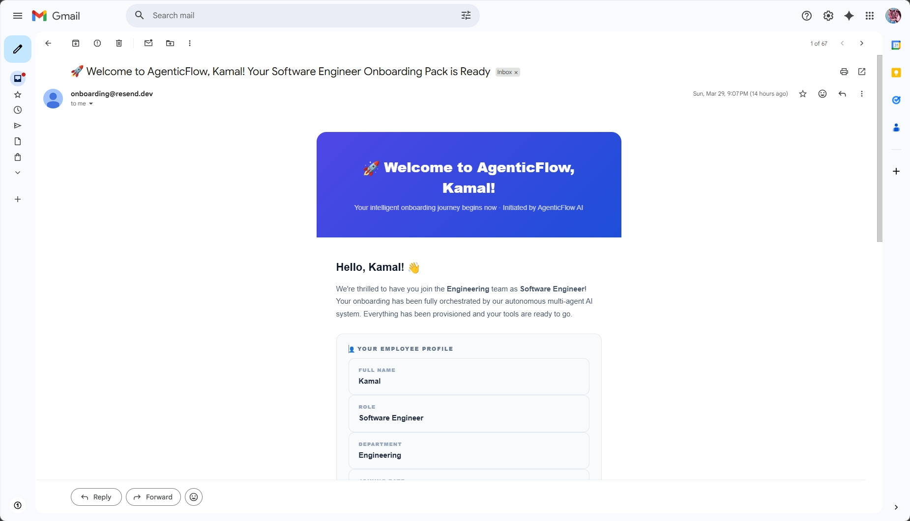

*Confirms: ✅ Welcome Pack sent via Resend API — ✅ Profile saved to MongoDB — ✅ Agents notified & tools provisioned*

---

### Step 6 — AI Onboarding Buddy (Telegram RAG Bot)

New joinees get 24/7 access to **AgenticFlowBuddyAI** — a RAG-based Telegram bot that answers company policy, tool setup, HR, and culture questions in real time. Out-of-scope questions are cleanly deflected to HR.

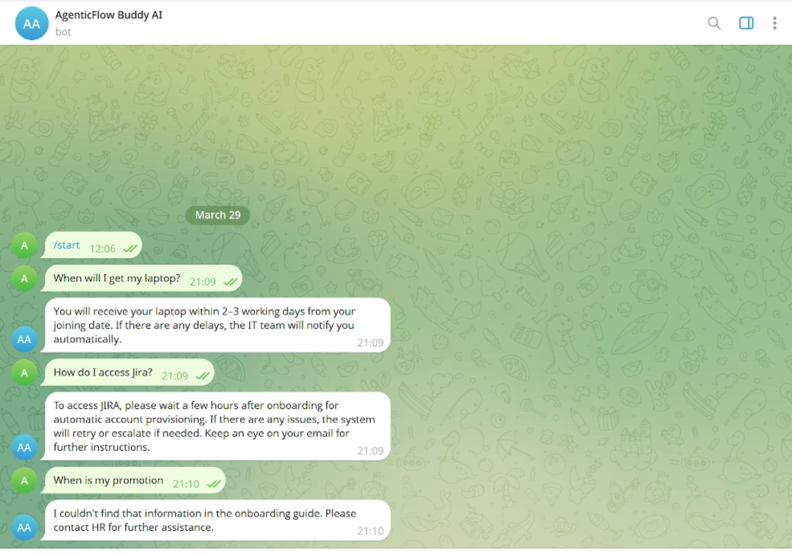

---

### Step 7 — Admin Logs In: Predictive Observatory

The Admin logs in as **Fleet Commander** and sees the full operational picture: agent health, engineer workloads, delayed tickets, rerouted approvals, and compliance overrides — all live from MongoDB.


---

### Step 8 — Multi-Agent Squadron Telemetry

Every agent in the neural ensemble broadcasts its **Health Status** and **Current Load** in real time. The Admin can drill into any agent's full log stream.

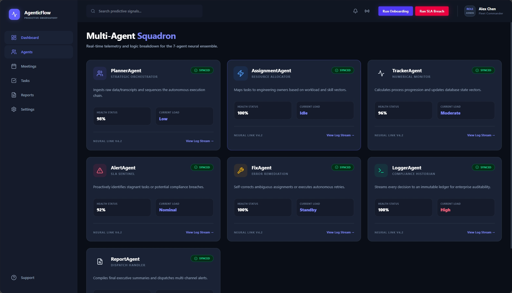

| Agent | Role | Health |
|:---|:---|:---:|
| **PlannerAgent** | Strategic Orchestrator | 98% |
| **AssignmentAgent** | Resource Allocator | 100% |
| **TrackerAgent** | Numerical Monitor | 96% |
| **AlertAgent** | SLA Sentinel | 92% |
| **FixAgent** | Error Remediation | 100% |
| **LoggerAgent** | Compliance Historian | 100% |
| **ReportAgent** | Dispatch Handler | Active |

---

### Step 9 — Meeting Room: WebSocket Multi-User Session

Participants join a **Secure Meeting Node** via WebSocket. Multiple users connect simultaneously, all synced to the same live transcription pipeline powered by the 7-agent squadron.

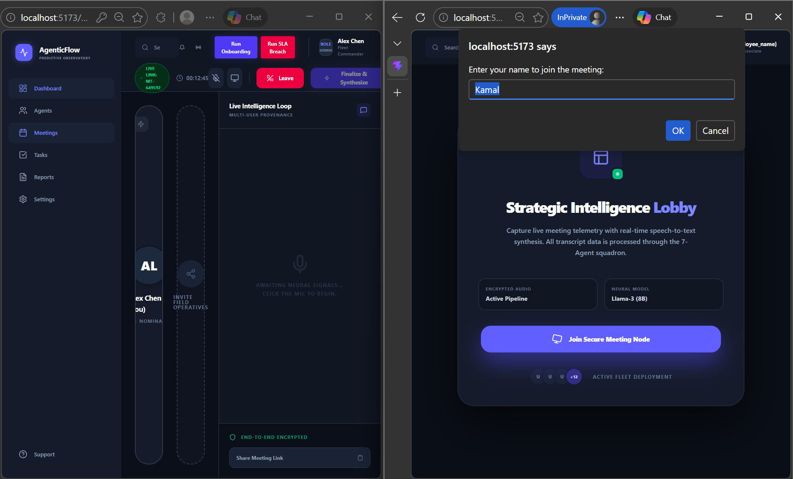

*Alex Chen and Kamal join the same meeting node. The Live Intelligence Loop captures all spoken content, attributed by speaker, and routes it to the backend in real time.*

---

### Step 10 — Live Transcription: Two-Browser Demo

The **Web Speech API** captures speech from each participant and streams it over WebSocket. Both participants see the transcript appear live, attributed by speaker — and the agents are already processing it.

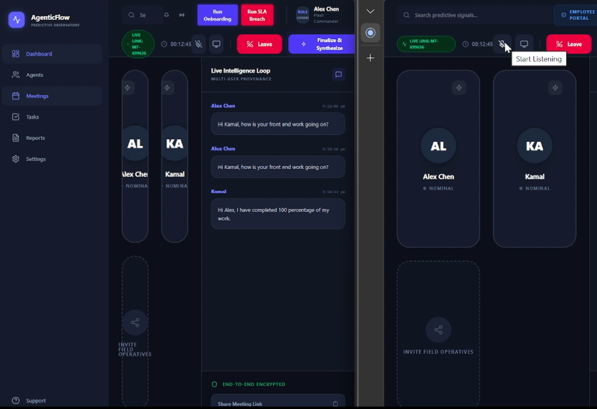

*Kamal says "I have completed 100 percentage of my work" — the TrackerAgent picks up the numerical signal and immediately updates the progress vector in MongoDB.*

---

### Step 11 — Transcripts Stored in MongoDB

Every utterance — `text`, `user`, `meeting_id`, `timestamp` — is persisted to the `transcripts` collection. 60 documents captured across sessions. The PlannerAgent reads directly from here to extract tasks.

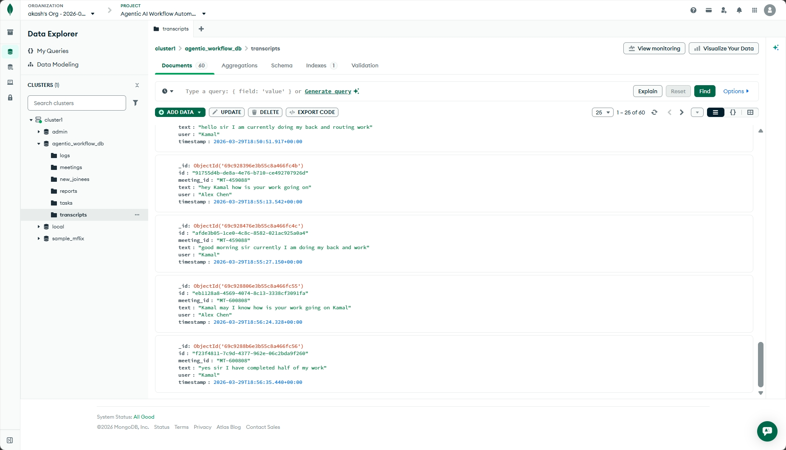

---

### Step 12 — Meeting-to-Action Pipeline: Task Extraction & Progress

Extracted tasks appear in the live pipeline view — each with an owner, real-time progress bar, SLA countdown, and telemetry flag. The AssignmentAgent and TrackerAgent keep these records current.

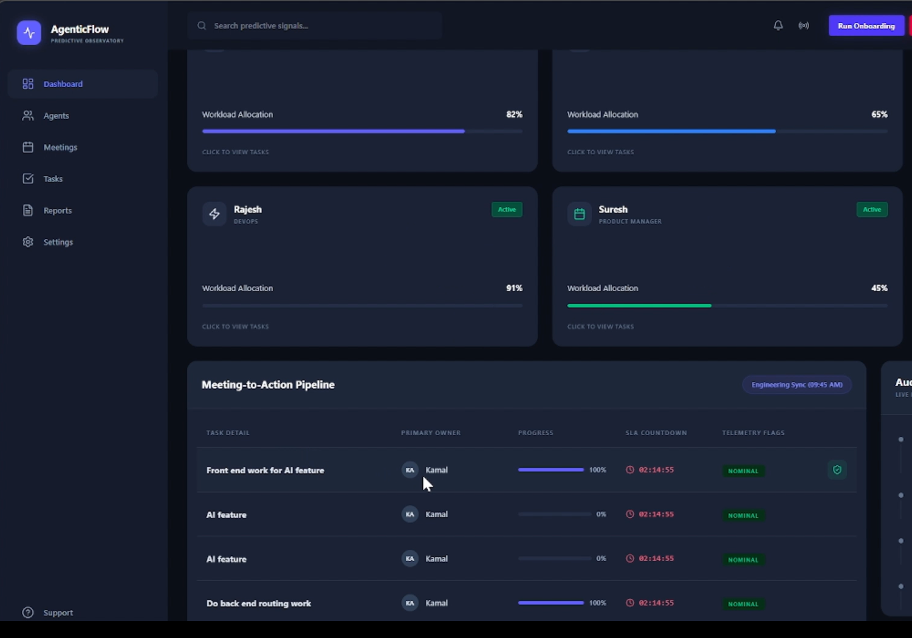

*"Front end work for AI feature" → Kamal → 100% ✅. Live SLA timers count down on all pending items.*

---

### Step 13 — Tasks Stored in MongoDB

Each extracted task is stored as a structured document: `task`, `person`, `deadline`, `needs_clarification`, `status`, `progress`, `workflow_id`. 29 task documents and counting.

![MongoDB — tasks Collection] (Prototype_Photos/tasks.png)

*The `needs_clarification` flag triggers the FixAgent when `true`. Status flows autonomously: `pending` → `in-progress` → `completed`.*

---

### Step 14 — Agent Decision Logs: Immutable Audit Trail

Every agent action is logged with `timestamp`, `workflow_id`, `agent`, `action`, and `result`. AssignmentAgent storing tasks. TrackerAgent initializing vectors. FixAgent balancing load. ReportAgent firing emails. All 518 of them.

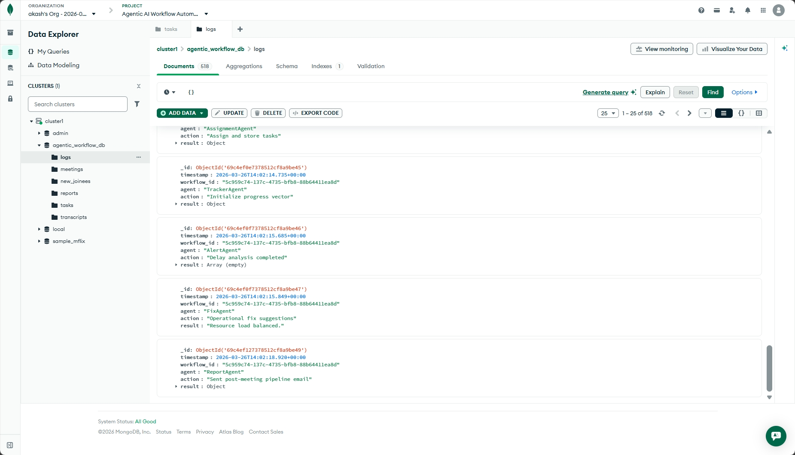

*The LoggerAgent writes: `"Resource load balanced."` after FixAgent resolves a conflict. `"Sent post-meeting pipeline email"` after ReportAgent dispatches. Every decision, verifiable.*

---

### Step 15 — Meetings Stored in MongoDB

Each session is recorded with a unique `meeting_id`, `title`, `status`, and `created_at` timestamp — so agents can query live meeting context at any point during execution.

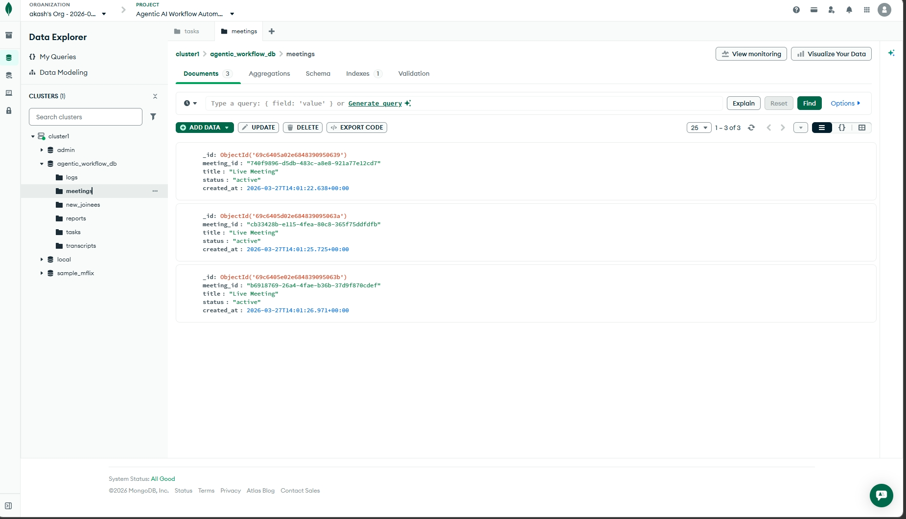

---

### Step 16 — Compliance Reports: Neural Evidence Hub

The **Reports** page surfaces every autonomous decision as a downloadable audit record. The ReportAgent calculates `automation_rate`, `autonomous_steps`, and `time_saved_minutes` for every workflow run.

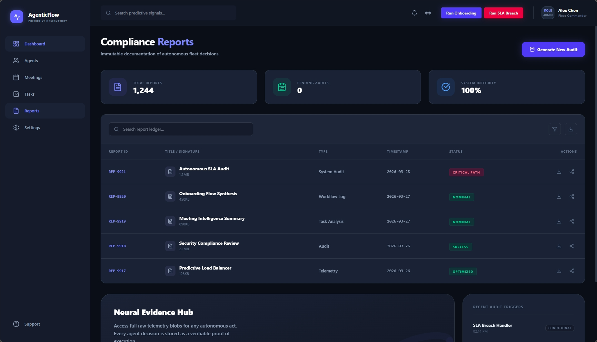

*1,244 total reports. 0 pending audits. 100% system integrity. Recent: Autonomous SLA Audit (CRITICAL PATH), Onboarding Flow Synthesis (NOMINAL), Meeting Intelligence Summary (NOMINAL).*

---

### Step 17 — Reports Stored in MongoDB

Report documents capture the full impact of each run: `summary`, `tasks_extracted`, `autonomous_steps`, `time_saved_minutes`, `automation_rate`, `efficiency`, `workflow_id`. Quantified, auditable, queryable.

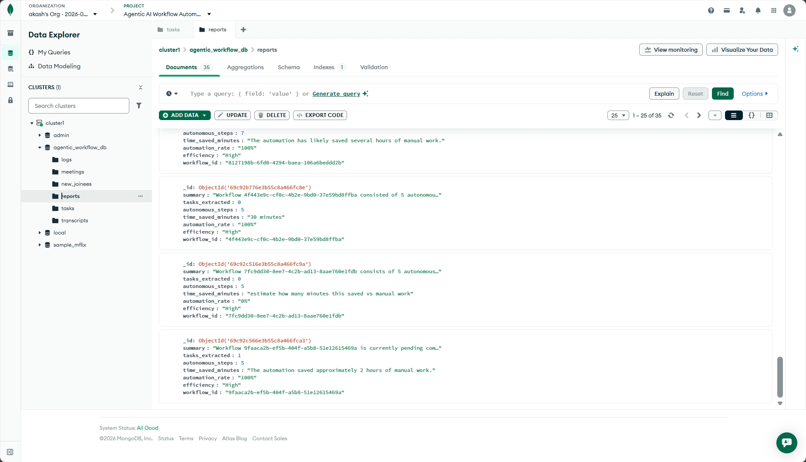

*`automation_rate: "100%"` — `efficiency: "High"` — `time_saved_minutes: "approximately 2 hours of manual work"` — every single run.*

---

## 🗄️ MongoDB Atlas: Complete Database Overview

All six collections live in `agentic_workflow_db`. Every agent reads from and writes to this shared state — forming the persistent backbone of the entire autonomous system.

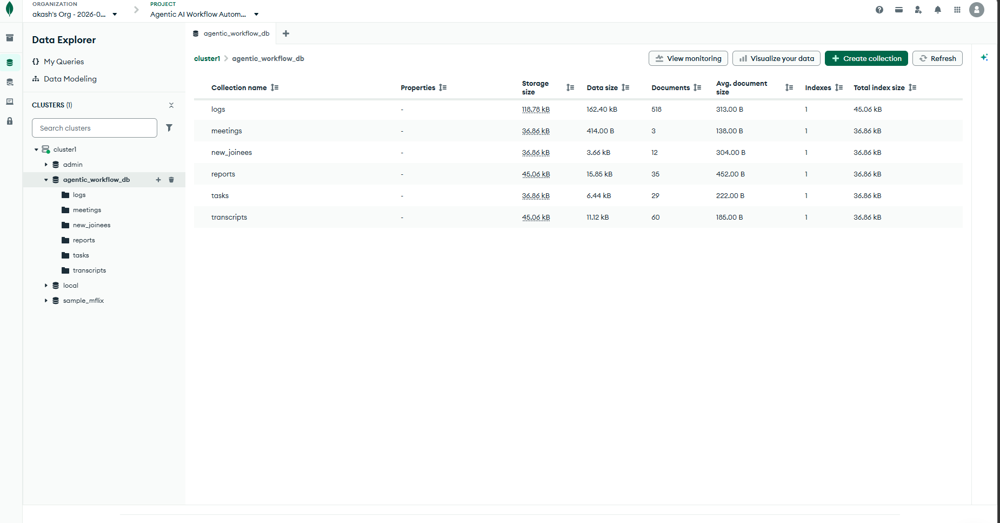

| Collection | Documents | What's Stored |
|:---|:---:|:---|
| `logs` | 518 | Immutable agent decision audit trail |
| `transcripts` | 60 | Live meeting speech-to-text records |
| `tasks` | 29 | Extracted action items with progress & SLA |
| `reports` | 35 | Workflow impact metrics & executive summaries |
| `new_joinees` | 12 | Onboarding records & provisioning status |
| `meetings` | 3 | Active meeting session metadata |

---


## ⚙️ 7-Agent Neural Architecture

```
TRANSCRIPT / TRIGGER INPUT
         │
         ▼
  ┌─────────────┐
  │ PlannerAgent│  ←── Ingests transcript, extracts tasks, flags ambiguities
  └──────┬──────┘
         │
         ▼
  ┌──────────────────┐
  │ AssignmentAgent  │  ←── Maps tasks to engineers via workload vectors → MongoDB tasks
  └──────┬───────────┘
         │
         ▼
  ┌──────────────┐
  │ TrackerAgent │  ←── Detects numerical progress signals, updates DB state vectors
  └──────┬───────┘
         │
         ▼
  ┌────────────┐
  │ AlertAgent │  ←── Sweeps for stagnant tasks or SLA breach risk
  └──────┬─────┘
         │
         ▼
  ┌──────────┐      ┌────────────────────┐
  │ FixAgent │ ───► │ ITEscalationAgent  │  (on unresolvable failure → ServiceNow)
  └──────┬───┘      └────────────────────┘
         │
         ▼
  ┌──────────────┐
  │ LoggerAgent  │  ←── Immutable compliance ledger → MongoDB logs (518 entries)
  └──────┬───────┘
         │
         ▼
  ┌──────────────┐
  │ ReportAgent  │  ←── Formats + dispatches via Resend API → MongoDB reports
  └──────────────┘
```

> Additional isolated topologies exist for `/onboarding` and `/sla-breach` triggers.

---

## 🏆 Scenario Coverage

### ✅ Meeting to Action
The **PlannerAgent** extracts action items from live transcripts and assigns owners. Ambiguous tasks (`needs_clarification = True`) route to the **FixAgent**, which determines the least-loaded engineer via MongoDB aggregation and reassigns. The **ReportAgent** emails all participants an executive summary on completion.

### ✅ SLA Breach Prevention
The **SLAMonitor** detects stagnant tickets. The **HRIntegrationAgent** verifies approver leave status via Workday. The **RerouteAgent** forces the ticket to the management delegate. The **AuditLogger** injects a compliance override record: *"Original approver on leave (>48h SLA) — ticket conditionally rerouted to delegate."*

### ✅ Employee Onboarding
The **OnboardingPlanner** sequences provisioning across `["Slack", "Email", "JIRA"]`. On JIRA failure → autonomous retry loop. On second failure → **ITEscalationAgent** logs a ServiceNow ticket. Pipeline converges on **CultureAgent** to assign a buddy and dispatch the welcome pack via Telegram + Resend.

---

## 📊 Evaluation Rubric

| Dimension | Weight | Implementation |
|:---|:---:|:---|
| **Autonomy Depth** | 30% | 7 sequential autonomous steps with LangGraph conditional edges — retry loops, skip logic, fallback escalation |
| **Multi-Agent Design** | 20% | Atomized responsibilities. Shared immutable `AgentState` passed across the full graph |
| **Technical Creativity** | 20% | LangGraph stateful execution. Model-agnostic via OpenRouter — OSS models for audit, larger models for planning |
| **Enterprise Readiness** | 20% | Full AuditLogger compliance trail. Emergency admin alerts via Resend when system cannot resolve autonomously |
| **Impact Quantification** | 10% | `automation_rate` and `time_saved_minutes` calculated per run, persisted to MongoDB reports collection |

---

## 💻 Tech Stack

| Layer | Technology |
|:---|:---|
| **AI / Orchestration** | LangChain, LangGraph, OpenRouter (model-agnostic) |
| **Backend** | Python, FastAPI, MongoDB Atlas (Motor Async) |
| **Frontend** | React.js, Vite, Framer Motion, Glassmorphism CSS |
| **Real-time Audio** | Web Speech API → WebSocket sync |
| **Notifications** | Resend API |
| **AI Buddy** | Telegram RAG Bot (`@AgenticFlowBuddyAI_bot`) |

---

## 🛠️ Running Locally

```bash
# 1. Start the backend
cd backend
python main.py

# 2. Start the frontend
cd frontend
npm run dev

# 3. Open the Matrix Dashboard
open http://localhost:5173
```

Click **"Launch New Sync"** to enter the lobby, then trigger any scenario:
- **`Run Onboarding`** — full employee onboarding pipeline
- **`Run SLA Breach`** — SLA rerouting and compliance override flow
- **Join a Meeting Node** — live transcription + Meeting-to-Action pipeline

---

<div align="center">

**Built for Track 2 — Autonomous Enterprise Workflows**

*AgenticFlow doesn't assist with work. It does the work.*

</div>
